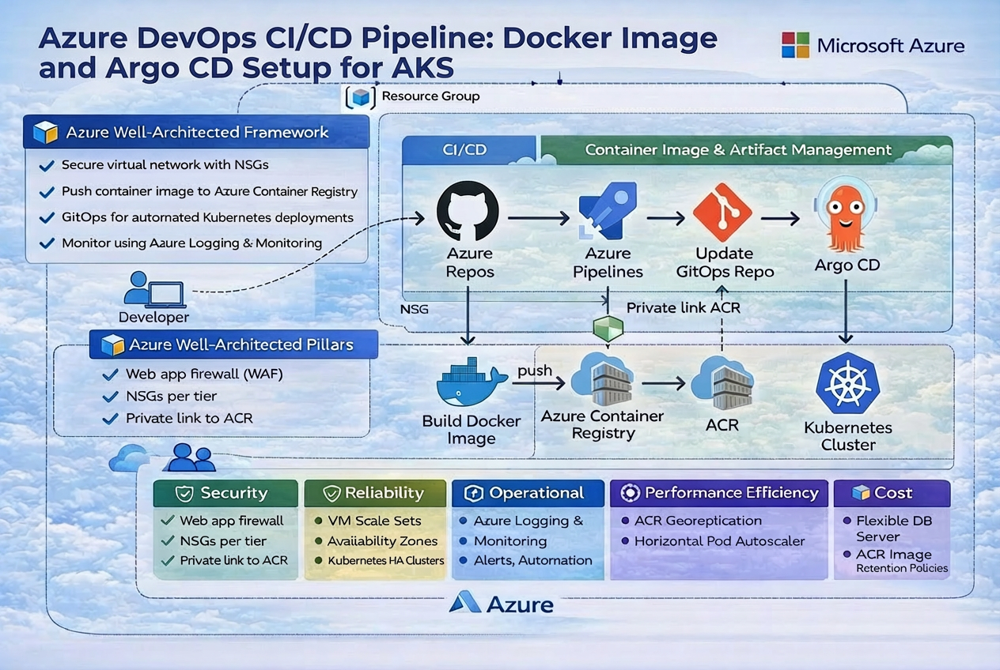

# 🚀 GitOps CI/CD on Azure with Argo CD & AKS

This project demonstrates how to build a **complete, real-world CI/CD pipeline** using **Azure DevOps and Argo CD** to automate Kubernetes deployments on **Azure Kubernetes Service (AKS)** using a **GitOps workflow**.

In the accompanying video, we walk through the full lifecycle — from configuring Azure DevOps pipelines to deploying and continuously reconciling applications in AKS using Argo CD’s **declarative, pull-based delivery model**.

--- 
## 🏗️ ☁️ Azure Well-Architected Framework Alignment and Architecture Overview

This architecture aligns with Microsoft’s **Azure Well-Architected Framework**, emphasizing intentional design decisions over default configurations.

This project intentionally aligns with the **Azure Well-Architected Framework**, focusing on real trade-offs rather than theoretical perfection.

## 🏗 High-Level Architecture

1. Developer commits code to Azure DevOps Repo
2. CI pipeline builds a Docker image
3. Image is pushed to Azure Container Registry
4. CI updates the image tag in the GitOps repo
5. Argo CD detects Git changes
6. Argo CD reconciles state into AKS
7. Kubernetes runs and maintains the application

### 🔐 Security
- No direct cluster access from CI pipelines
- Pull-based deployments reduce blast radius
- Private container registry (ACR)
- Git as the single source of truth

### ⚙️ Reliability
- Declarative Kubernetes manifests
- Argo CD continuously reconciles desired state
- Self-healing via Kubernetes replicas

### 🚀 Operational Excellence
- Clear separation of CI and CD responsibilities
- Auditable deployments via Git history
- Simple rollback by reverting commits

### 💰 Cost Optimisation
- Lightweight tooling
- No over-engineered control planes
- Scales incrementally with demand

### 🔄 Performance Efficiency
- Container-native runtime
- Fast feedback loops via CI/CD automation
---

## 📌 Project Overview

This repository showcases an **end-to-end cloud-native delivery pipeline** built with modern platform engineering principles:

- **CI** builds and publishes container images using Azure DevOps
- **CD** is handled via GitOps, not pipelines
- **Argo CD** continuously reconciles desired state from Git
- **Kubernetes (AKS)** provides scalable, resilient runtime

The goal is not just to “deploy an app”, but to demonstrate **how systems should be built when no one is rushing** — with clarity, safety, and long-term operability in mind.

---

## 🧰 Tools & Technologies Used

- **Azure DevOps**
  - Repos
  - Pipelines
- **Azure Kubernetes Service (AKS)**
- **Argo CD**
- **Docker**
- **Azure Container Registry (ACR)**
- **Python (Flask)**
- **GitOps Workflow**

**Key principle:**  
> Pipelines build artifacts. Git deploys them.

---

## 📚 Lessons Learned

- GitOps significantly reduces operational ambiguity
- Pull-based CD eliminates entire classes of deployment failures
- Clear repo boundaries matter more than tool choice
- Argo CD acts as a control plane, not just a deployer
- “Boring” infrastructure scales better than clever solutions

---

## ⚠️ Challenges Faced

- Shifting from imperative to declarative mental models
- Designing repo structures that scale beyond demos
- Balancing security with developer velocity
- Avoiding over-automation early
- Deciding where CI responsibility should end

Each challenge informed better architectural decisions.

---

## 🧾 Architectural Decision Records (ADR Summary)

| ADR ID | Decision | Context | Rationale (Why) | Trade-offs / Consequences |
|------|--------|--------|------------------|---------------------------|
| **ADR-001** | Adopt GitOps using Argo CD for Continuous Delivery | Traditional pipeline-driven deployments require elevated cluster access and mix build and deploy concerns | GitOps enables pull-based deployments, drift detection, auditability, and a clear separation between CI and runtime | Initial learning curve; requires Git discipline and a declarative mindset |
| **ADR-002** | Separate CI (Azure DevOps) from CD (Argo CD) | Combining build and deployment logic in pipelines leads to fragile and tightly coupled workflows | Improves security, clarity, and system evolvability by assigning clear ownership boundaries | Requires managing multiple repositories and clearer process definitions |
| **ADR-003** | Use Azure Kubernetes Service (AKS) as the runtime platform | Self-managed Kubernetes increases operational burden for upgrades, networking, and security | AKS reduces undifferentiated heavy lifting while preserving Kubernetes flexibility | Some platform-specific abstractions and managed-service constraints |
| **ADR-004** | Use declarative Kubernetes manifests instead of imperative scripts | Imperative deployments make state hard to reason about and reproduce | Declarative manifests provide deterministic, auditable, and reproducible deployments | Less ad-hoc flexibility; requires upfront design discipline |
| **ADR-005** | Use immutable container image tags for deployments | Mutable tags (e.g. `latest`) cause non-deterministic deployments | Ensures traceability, repeatability, and safe rollbacks | Slightly more verbose manifests and image management |
| **ADR-006** | Build Linux ARM64 container images | Apple Silicon dev environments and ARM-based cloud nodes are increasingly common | Improves local parity, performance, and cost efficiency | Requires explicit platform configuration and compatible tooling |
| **ADR-007** | Expose the application via Kubernetes Service (LoadBalancer) | The application requires a simple external entry point for validation and demos | Provides reliable traffic exposure with minimal configuration in AKS | Not optimised for advanced routing, TLS, or traffic control |
| **ADR-008** | Avoid early over-engineering (no mesh, no operators) | Early complexity increases cognitive load and slows iteration | Simplicity improves understanding, maintainability, and onboarding | Advanced features deferred to future iterations |

---

## 🔮 Next Improvements

Potential future enhancements include:

- Health, readiness, and liveness probes
- Helm or Kustomize overlays per environment
- Azure Entra ID (AAD) integration with Argo CD
- Secrets management using Azure Key Vault
- Progressive delivery (blue/green or canary)
- Observability with Prometheus and Grafana

---

## 💡 Why This Project Matters

This project isn’t about tools — it’s about **how teams deliver software sustainably**:

- Predictable deployments
- Reduced cognitive load
- Clear ownership boundaries
- Auditable and reversible changes

It demonstrates what **good platform engineering** looks like in practice.

---

## 🧠 Final Reflection

This system represents a **deliberate, well-architected approach** to modern cloud-native delivery.

Azure DevOps, Kubernetes, and Argo CD work together cleanly — without unnecessary complexity — to enable teams to move fast **without breaking trust**.
